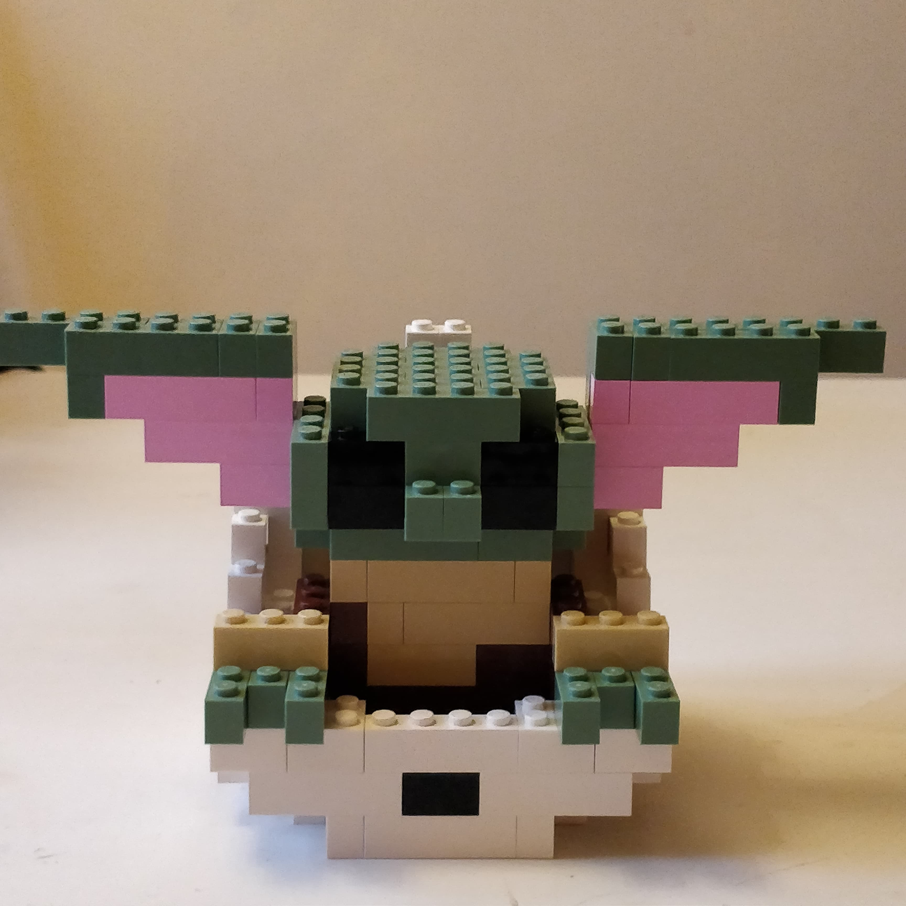

```{r setup, include=FALSE}
source(here::here("R","sidenote.R"))
knitr::opts_chunk$set(
fig.align = 'center'
)
```

## Motivation {#intro}

As a kid I was fascinated with LEGO sets, and last year, with the additional free time that lockdown provided, I got back into playing around with some old pieces. Discovery of the _amazing_ [`brickr`](https://github.com/ryantimpe/brickr) R package, which allows you to create 3D models from LEGO bricks, led me to marry my interests and try to create a levitating LEGO Baby Yoda/Grogu model.

The finished product is shown in the GIF below:

`r htmltools::div(id= "gif")`

```{r, echo = FALSE}
knitr::include_graphics("babyyoda.gif")
```

&nbsp;

> `r blockquote_author("Always pass on what you have learned.", "Yoda, \"Star Wars: Return of the Jedi\"")`

Taking the true Yoda's advice, this post contains the detailed brick requirements and building instructions for creating your own Baby Yoda/Grogu LEGO model.

&nbsp;

## Designing the model

The model was designed using `brickr` and was adapted from the LEGO Baby Yoda/Grogu model originally designed by Ryan Timpe.`r sidenote("See [here](https://gist.github.com/ryantimpe/3893fdd0f94138d027bae35bf38b57c7) for the code for that model, and [here](https://github.com/ryantimpe) for Ryan's GitHub profile.")` Adaption was necessary, as the original model contained a number of "floating bricks" (i.e. bricks that are not supported by another brick from either above or below), which work fine when rendering the model in R but cannot be used in a physical version.

All data and code needed to reproduce the model are available from the GitHub repository for this project.`r sidenote_link("https://github.com/mcguinlu/baby-yoda")`

### Build pieces

The pieces you will need to build your own LEGO Baby Yoda/Grogu model are listed in the image below. These can be acquired from the Pick A Brick service on the LEGO store website.`r sidenote_link("https://www.lego.com/en-gb/page/static/pick-a-brick")` The total cost for all pieces included in this model was ~£30 pounds.

``` {r, echo = FALSE}
knitr::include_graphics("babyyoda_pieces.png")
```

### Instructions

The instructions below will guide you through building your own Baby Yoda, using the pieces detailed in the previous section. It can sometimes be awkward to get some of the pieces to work together when building from the bottom up, as they are supported by a brick on the next level up. In this case, a useful tip is to try building down (i.e. descending through the steps).

``` {r, echo = FALSE}
knitr::include_graphics("babyyoda_instructions.png")
```

The finished model should look something like this: 

`r tufte::margin_note("More photos of the finished model from different angles can be found [here](https://github.com/mcguinlu/baby-yoda/tree/master/finished_model).")`
```{r, echo = FALSE}


```

&nbsp;

## Make him float!

As shown in the GIF at the start of this post,`r sidenote("[Jump to GIF](#gif)")` this model was designed to work with a electromagnetic levitation display to give it a true-to-life feel. I used the Hongzer Magnetic Levitation Platform (£6-7 pounds from Amazon),`r sidenote_link("https://www.amazon.co.uk/gp/product/B07YKY6K8J/ref=ppx_yo_dt_b_asin_title_o00_s00?ie=UTF8&psc=1")` but it will (/should!) work with any display where the diameter of the floating magnet is <5.5cm.